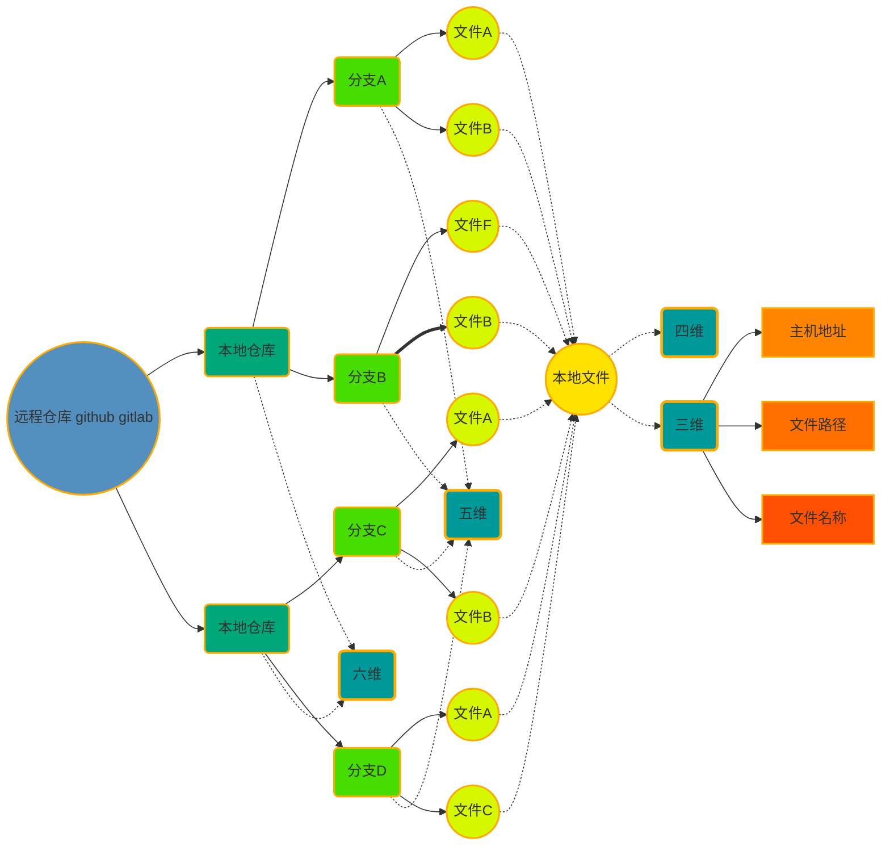
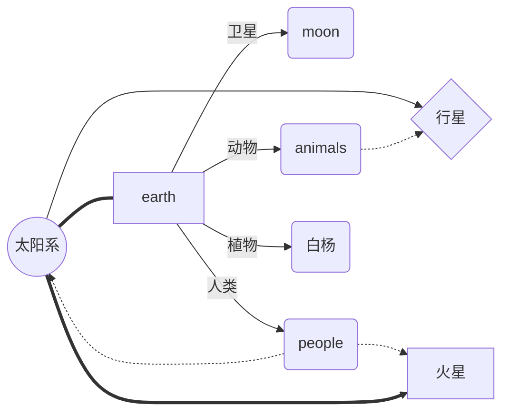

## 写一份优雅的 readme
### 标题
  # this is a H1 #
  ## this is a H2
  ### this is a H3 ###
  #### this is a H4
  ##### this is a H5
  ###### this is a H6
  this is a H1
  ============
  this is a H2
  ------------
***********************************************************
### 锚点
  #### point
-----------------------------------------------------------
### 换行
  * 可以一行的最后使用两个或两个以上的空格， 也可以使用 \<br>标签  
  我是一行文本   
  我是第二行文本<br> 我是第三行文本

***********************************************************
### 特殊字符 & 和 <
  * &copy;
  * a&b
  * &amp;
  * &
  * <
  * 1 < 2
  * &lt;
-----------------------------------------------------------
### 字体
  - 字体与标识符之间不能加空格
  - 加粗
    - **bold**
  + 斜体
    * *斜体文字*
  + 斜体加粗
    - ***斜体加粗的文字***
  + 删除线
    - ~~需要删除的内容 使用删除线~~
-----------------------------------------------------------
### 引用
  > 引用1
  > 2
  >> 3
  >>> 4
___________________________________________________________
### 列表
  * 无序列表 满屏都是无序列表
  * 有序列表
    - 1. 列表项1
    - 2. 列表项2
    - ....
-----------------------------------------------------------
[linkId]: www.baidu.com "百度一下，你就知道！"
[target]: www.baidu.com "百度一下，你什么都不知道！"
### 超链接
  * 行内式链接
    * [跳转到锚点](#user-content-point)
    * [付款就用付呗](www.51fubei.com)
    * [带title的链接](www.baidu.com "百度一下")
  * 参考式链接 使用 Markdown 的参考式链接，可以让文件更像是浏览器最后产生的结果，让你可以把一些标记相关的元数据移到段落文字之外，你就可以增加链接而不让文章的阅读感觉被打断。
    * [链接的描述][linkId]
    * linkId 规范
      * 方括号（前面可以选择性地加上至多三个空格来缩进），里面输入链接文字
      * 接着一个冒号
      * 接着一个以上的空格或制表符
      * 接着链接的网址
      * 选择性地接着 title 内容，可以用单引号、双引号或是括弧包着
  * 隐式链接标记功能让你可以省略指定链接标记，这种情形下，链接标记会视为等同于链接文字，要用隐式链接标记只要在链接文字后面加上一个空的方括号
    * [target][]
------------------------------------------------------------
### 代码段
  * 代码段在MarkDown中会被转化到 &lt;code> 标签中
  * 单行代码
    * `let arr = new Array.form(new Set([1, 2, 4, 1, 3, 999]))`
  * 如果代码中有反引号 ` 存在，则需要使用更多的反引号来开始和结束代码块
    * `` let str = `this is s String named &{name}` ``
  * 多行代码块
    * 使用 ``` 分隔 并且需要独占一行
``` javascript
funtion testMarkDown () {
  alert ('this is a function for testing.')
}
```
``` java
public class Person {
  private final String name;
  static Boolean canUseTools = true;
  public Person (name) {
    this.name = name;
  }
  public String say () {
    return this.getName()
  }
  private String getName () {
    return this.name;
  }
}
Person p = new Person("coco")
````
---------------------------------------------------------
[imgId]: https://ss1.bdstatic.com/70cFuXSh_Q1YnxGkpoWK1HF6hhy/it/u=2934004095,3516777702&fm=26&gp=0.jpg "橡皮人路飞"
### 图片
  * 行内式
    * 一个惊叹号 !
    * 接着一个方括号，里面放上图片的替代文字
    * 接着一个普通括号，里面放上图片的网址，最后还可以用引号包住并加上 选择性的 'title' 文字。
    * 
  * 参考式
    * ![路飞][imgId]
  * 使用普通的 &lt;img>，可以设置宽高
    * 
------------------------------------------------------------------
### 转移符号 \
  * \<
  * \*
  * \[]
  * ....
------------------------------------------------------------------
### 表格

name | age | sex | hobbit | work
--- | :---- | ---: | :----: | --
小明 | 12 | 男 | 滚出去 | 学生
小华 | 32 | 男 | 爱小花 | IT男
小红 | 18 | 女 | 花季少女 | 吃喝玩乐
<br>

版本号 | 项目名称 | 负责人 | 参与人 | 更新时间| 跟新内容| 技术支持
:------:|:-----------:|:-------:|:-----------------:|:---------:|:----------------------:|:-----------:
1.0 | readme 测试 | Mr Qyj | 你、我、他 | 2019-08-13 | 测试readme | network and others
1.1 | git 测试 | Mr Qyj | 你、我、他 | 2019-08-16 | 测试git | network and others

******************************************************************
### flow流程图
```flow
st=>start: Start:>www.baidu.com
op=>operation: Your Operation
cond=>condition: Yes or No?
e=>end
st->op->cond
cond(yes)->e
cond(no)->op
```

```flow
st=>start: Start:>http://www.google.com[blank]
e=>end:>http://www.google.com
op1=>operation: My Operation
sub1=>subroutine: My Subroutine
cond=>condition: Yes
or No?:>http://www.google.com
io=>inputoutput: catch something...
para=>parallel: parallel tasks

st->op1->cond
cond(yes)->io->e
cond(no)->para
para(path1, bottom)->sub1(right)->op1
para(path2, top)->op1
```
```flow
st=>start: 北斗系统1.1:>https://fshows.yuque.com/tech-ozd0u/oul77n/kggcfy "北斗系统1.1"
productOp=>operation: 产品会|past
technologyOp=>operation: 技术会
submiteBug=>subroutine: 提交BUG
resolveBug=>operation: 修BUG中...
resolveCond=>condition: 改好了吗
codeOp=>operation: 疯狂coding
uedOp=>operation: UED评审会
testOp=>operation: 测试评审会
UEDInspect=>operation: UED验收
UIBug=>condition: 视觉BUG
testInspect=>operation: 测试验收
testBug=>condition: 测试问题
publishOp=>operation: 发布上线
onlineBug=>condition: 线上问题
e=>end
st->productOp->technologyOp->uedOp->codeOp->UEDInspect->UIBug
UIBug(yes)->testInspect->testBug
UIBug(no)->submiteBug(right)->resolveBug(right)->resolveCond
resolveCond(yes, up)->UEDInspect
resolveCond(no)->resolveBug
testBug(yes)->publishOp->onlineBug
testBug(no)->submiteBug
onlineBug(yes)->e
onlineBug(no)->submiteBug
```
```txt
nodeName=>nodeType: nodeText[|flowstate][:>urlLink]

Items in [] are optional.

nodeName defines the nodes variable name within the flowchart document.

nodeType defines what type the node is. See Node Types for more information.

nodeText is the text that will be inserted into the node. Newlines are allowed and will be reflected in the rendered node text.

flowstate is optional and uses the | operator that specifies extra styling for the node.

urlLink is optional and uses the :> operator to specify the url to link to.
```
***在连接流程图的时候，对于condition类型，有yes和no两个分支，默认情况下，yes在下面显示，right在右面显示。如果同时限制left和right，那么将按照默认的位置显示；如果只限制其中一个，那么另一个也自动限定，则可以按照设定的进行显示。***
#### nodeType
* start
* end
* operation
* subroutine
* condition
* inputoutput
********************************************************************
### mermaid 流程图


***连接线使用三个符号 表示虚线的点和箭头分别站一个位置***
#### 显示方向
* TB/TD（ top bottom/top down）表示从上到下
* BT（bottom top）表示从下到上
* RL（right left）表示从右到左
* LR（left right）表示从左到右
#### 节点类型
* 默认节点： A
* 矩形节点： B[矩形]
* 圆角矩形节点： C(圆角矩形)
* 圆形节点： D((圆形))
* 非对称节点： E>非对称]
* 菱形节点： F{菱形}
#### 节点连接类型
* 箭头连接 A1- ->B1
* 开放连接 A2- - -B2
* 虚线箭头连接 A3.->B3 或者 A3-.->B3
* 虚线连接 A4.-B4 或者 A4-.-B4
* 粗线箭头连接 A5==>B5
* 粗线开放连接 A6===B6
* 标签虚线箭头连接 A7-.text.->B7
* 标签开放连接 A8- -text- - -B8
* 小结：
  * \- 表示线直线
  * \> 表示箭头
  * \. 表示虚线
  * = 表示粗直线
#### 节点样式
* fill：节点填充颜色
* fill-opacity：填充透明度
* stroke：边框颜色
* stroke-width：边框宽度
* 样式写法与 SVG 样式写法一致
---------------------------------------------------------
## 流畅的使用 git 命令行搞定一切
### git 分支生命周期
1. 分支创建
```git
git branch  //查看本地分支
git branch -a //查看远程分支
git branch test //创建本地分支
git push --set-upstream origin test // 将本地创建的分支同步到远端
git checkout test //切换到分支
```
2. 操作分支
  * git add ./fileurl 往暂存区添加文修改
  * git commit -m 'memo' 将暂存区中的修改提交到本地代码库中
  * git push / git push -f 将本地的修改同步到远端
  * git log 查看提交记录
  * git reset --soft/mixed/hard
    - soft
    - mixed 将暂存区的内容与远端同步
    - hard 将本地仓库和暂存区强制还原为远端仓库
3. 分支合并
4. 分支删除
  * 删除本地分支：git branch -d branchName
  * 删除远端分支：git push origin -d branchName
  * ***删除分支前需要切换到其他分支***

  ***this is a new line for examination***

  ***this is a new line for cherrypick***


  ***new line***